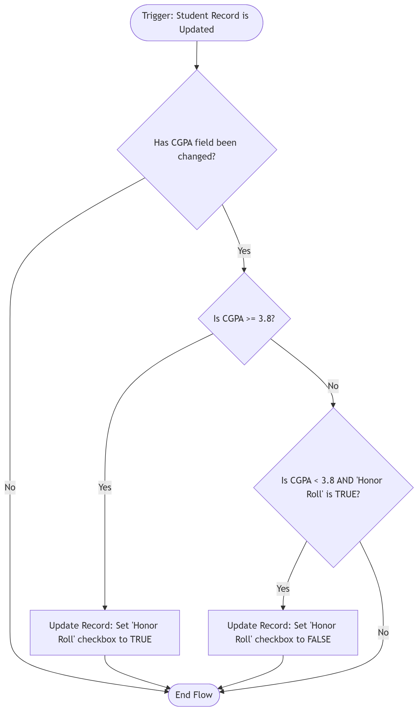

## 1. What is Flow Builder?

Think of Flow Builder as the "brain" of Salesforce automation. It is a visual, point-and-click tool that lets administrators build complex, automated business processes without writing a single line of Apex code. Essentially, you are drawing a logical flowchart on your screen, and Salesforce turns that flowchart into working software to execute actions, update data, and send communications automatically.

---

## 2. Types of Flows Explained

While Salesforce offers several flow types, these are the two core pillars of automation:

* **Screen Flow:** A Screen Flow provides a custom user interface (UI). It acts like a wizard or a multi-step form that guides a user through a process. It can prompt the user for specific information, display data back to them, and then create or update records based on their inputs. 
  *(Analogy: Like a TurboTax questionnaire that guides you step-by-step through your taxes.)*

* **Record-Triggered Flow:** A Record-Triggered Flow runs entirely in the background. It "listens" for a specific database event—like a record being created, updated, or deleted—and automatically fires a sequence of actions. It requires zero user interaction to run once the trigger conditions are met.
  *(Analogy: Like an automated email receipt that instantly hits your inbox the second you buy something online.)*

---

## 3. My Automation Ideas (College Management System)

Based on our `Campus Connect` Data Model, here are 5 ways I would use Flow Builder to automate daily university operations:

1. **The "Class Registration" Wizard (Screen Flow):** Placed on the Student Portal. Instead of manually creating an `Enrollment__c` junction record, the student clicks "Register." A clean UI pops up, asks which term they are registering for, lets them select courses from a filtered list, and automatically creates the correct enrollment records behind the scenes.
2. **Automated Welcome Letter (Record-Triggered Flow):** When an Admissions Officer updates a `Student` record's "Application Status" to *Admitted*, this background flow instantly fires and sends a personalized Welcome Email with next steps.
3. **Honor Roll Auto-Tagging (Record-Triggered Flow):** When a professor updates a student's `CGPA__c`, this flow checks if the new CGPA is 3.8 or higher. If it is, the flow automatically checks the `Honor_Roll__c` checkbox on the student's record.
4. **Professor Onboarding (Screen Flow):** When a new faculty member is hired, HR runs a Screen Flow. It prompts HR to enter the professor's details and select their `Department__c`. Upon clicking finish, the flow creates the `Professor__c` record, provisions their IT access, and creates a standard "Office Hours" record assigned to them.
5. **Academic Warning Alert (Record-Triggered Flow):** If a student's `CGPA__c` drops below 2.0, this flow automatically assigns a high-priority `Task` to the student's Academic Advisor, prompting them to schedule an intervention meeting.

---

## 4. Flow Diagram: Honor Roll Auto-Tagging

*(Below is the logical mapping for Automation Idea #3, detailing the background decision process for updating a student's Honor Roll status.)*

  

---

## 5. Manual vs. Automated Process

* **The Manual Process:** To manage the Honor Roll, a staff member would have to run a weekly report of all student CGPAs, manually sort them, open each student's record who has a 3.8+, click edit, check the "Honor Roll" box, and hit save. This takes hours, is prone to human error (skipping a name), and means data is out-of-date until the weekly report is run.
* **The Automated Process (Flow):** The exact millisecond a professor inputs a grade that pushes a CGPA to 3.8, the system checks the box. Zero human hours spent, 100% accuracy, and the data is perfectly real-time.

---

## 6. Reflection: Why Automation Matters in Enterprise Systems

In an enterprise environment, scale is the biggest enemy of efficiency. A college doesn't process ten students; it processes tens of thousands. 

If employees are bogged down with repetitive, manual data entry, they aren't doing the high-value work they were hired for (like actually advising students). Automation matters because it guarantees **consistency, compliance, and speed**. It ensures that business rules are enforced flawlessly every single time, drastically reducing administrative overhead and creating a seamless, instant experience for the end-user.
